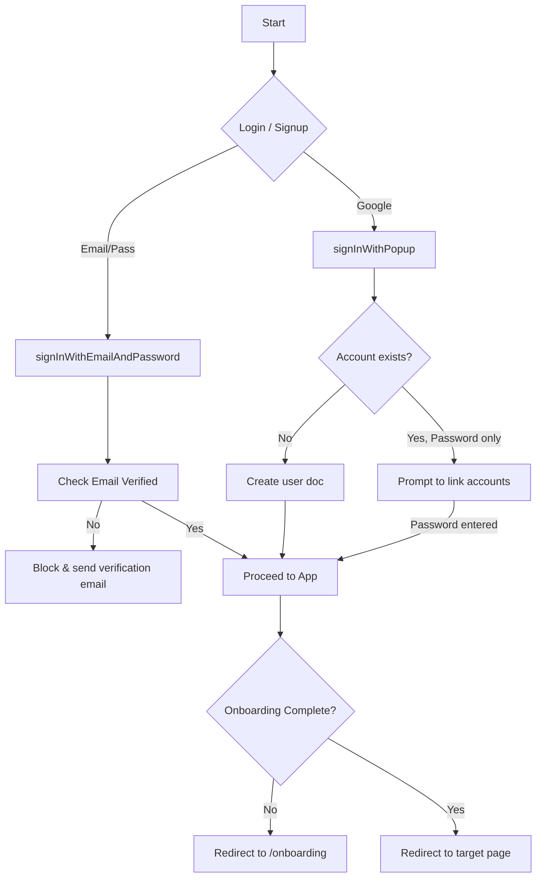

# Feature: Auth & Onboarding

Handles user registration, login, auto account-linking (Google + Password), and the mandatory onboarding wizard.

## Files Involved
- `src/contexts/AuthContext.jsx`
- `src/pages/Login.jsx`, `Signup.jsx`, `ForgotPassword.jsx`, `VerifyEmail.jsx`
- `src/pages/Onboarding.jsx`, `SetupOwnerProfile.jsx`
- `src/components/OnboardingGuard.jsx`, `ProtectedRoute.jsx`

## Collections Touched
- `users` (Reads/Writes)

## User Flow

## Edge Cases Handled in Code
- **Google Linking**: If a user creates an account with email/password, then later clicks "Continue with Google", Firebase throws `auth/account-exists-with-different-credential`. The app catches this, enters a `linkPending` state in `Login.jsx`, prompts for their password, and links the Google credential to the existing account seamlessly.
- **Email Verification**: Blocked at login if `user.emailVerified` is false.
