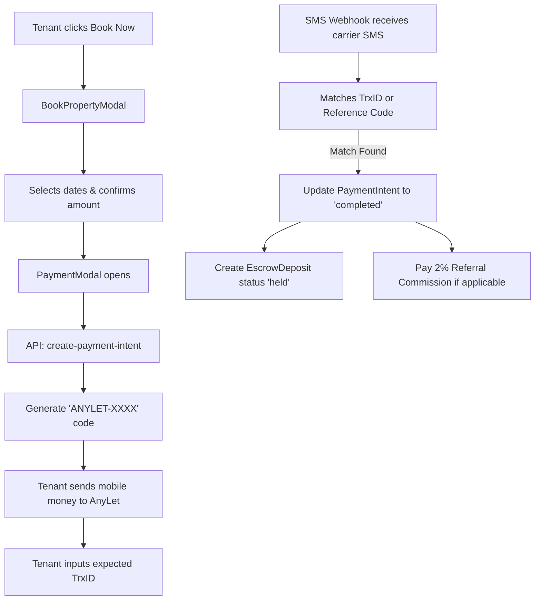

# Feature: Payments & Escrow

The core financial engine of AnyLet. Allows tenants to deposit booking amounts into an escrow system via mobile money providers (bKash, Nagad, Rocket).

## Files Involved
- `src/components/PaymentModal.jsx`
- `src/components/BookPropertyModal.jsx`
- `api/create-payment-intent.js`
- `api/sms-webhook.js`
- `api/request-withdrawal.js`
- `src/pages/MyPayments.jsx`

## Collections Touched
- `paymentIntents`
- `escrowDeposits`
- `payments`
- `commissions`

## The Booking Flow

## Security & Edge Cases
- **No Direct Transfers**: Tenants never send money directly to owners. All funds route through the AnyLet escrow system.
- **Timing Attacks**: The `sms-webhook.js` uses `crypto.timingSafeEqual` with padded buffers to prevent attackers from guessing valid transaction IDs via response times.
- **Provider Validation**: Strictly validates that the parsed amount in the SMS matches the expected escrow amount (with a small 1 BDT tolerance for edge cases).
