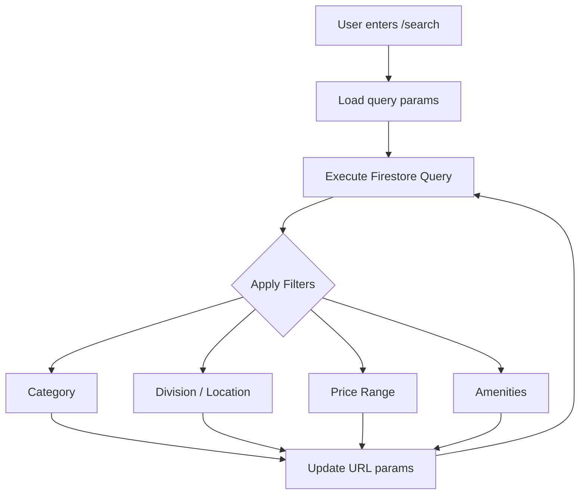

# Feature: Property Search & Filters

Allows tenants to discover properties by division, category, price, and amenities.

## Files Involved
- `src/pages/Search.jsx`
- `src/components/SearchCard.jsx`
- `src/utils/safeQuery.js`

## Collections Touched
- `properties` (Read-only)

## User Flow

## Edge Cases Handled in Code
- **URL Sync**: Filter state is aggressively synced to the URL `searchParams`. This allows users to share a link to a specific filtered view (e.g. `?division=Dhaka&maxPrice=15000`).
- **Responsive Layout**: On mobile, filters live inside a slide-up bottom sheet. On desktop, they snap into a persistent left-hand sidebar (`--spacing-sidebar-w`).
- **Pagination / Limits**: Handled gracefully with `safeQuery` utility to prevent aggressive read billing on large datasets.
