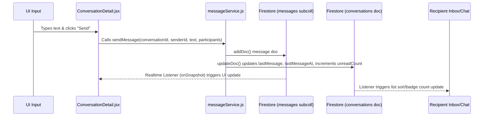

# 📋 COMPLETE CODEBASE & STRUCTURE AUDIT: ANYLET MESSAGING SYSTEM
**Audit Persona:** Chief Audit Officer / Senior Software Architect (10+ Years Experience)
**Purpose:** Hand-off documentation for an AI developer to rebuild/refactor the system.

---

## 📂 1. FULL PROJECT TREE
Below is the complete file and folder tree of the workspace (excluding build outputs, `.git`, `node_modules`, and generated iOS/Android build files):

```text
AnyLet Web/
├── .env.local
├── .gitignore
├── README.md
├── capacitor.config.json
├── eslint.config.js
├── firebase.json
├── firestore.indexes.json
├── firestore.rules
├── fix_router.js
├── index.html
├── package-lock.json
├── package.json
├── test-dashboard-render.js
├── test-dashboard.js
├── update_theme.js
├── vercel.json
├── vite.config.js
├── api/
│   ├── cloudinary-sign.js
│   ├── cron-rent-reminders.js
│   ├── process-payment-webhook.js
│   ├── set-admin-claim.js
│   ├── verify-kyc.js
│   └── _lib/
│       ├── firebaseAdmin.js
│       └── requireAdmin.js
├── public/
├── scripts/
│   ├── check.js
│   ├── cleanup.js
│   ├── detailedCheck.js
│   └── screenshot-pages.mjs
└── src/
    ├── App.css
    ├── App.jsx
    ├── firebase.js
    ├── index.css
    ├── main.jsx
    ├── testWrite.js
    ├── assets/
    │   └── react.svg
    ├── components/
    │   ├── AdminClaimsTab.jsx
    │   ├── AdminKycTab.jsx
    │   ├── AdminReviewsTab.jsx
    │   ├── AdminRoute.jsx
    │   ├── BookPropertyModal.jsx
    │   ├── BottomNav.jsx
    │   ├── CityGrid.css
    │   ├── CityGrid.jsx
    │   ├── ConfirmationModal.css
    │   ├── ConfirmationModal.jsx
    │   ├── CustomCursor.jsx
    │   ├── ErrorBoundary.jsx
    │   ├── FeaturedListings.jsx
    │   ├── Footer.jsx
    │   ├── Header.css
    │   ├── Header.jsx
    │   ├── Hero.css
    │   ├── Hero.jsx
    │   ├── HorizontalPropertyCard.jsx
    │   ├── InstallPrompt.jsx
    │   ├── LinkStyles.css
    │   ├── ListingPreviewModal.jsx
    │   ├── LoadingScreen.jsx
    │   ├── LocationPickerMap.jsx
    │   ├── Modal3D.jsx
    │   ├── MoveInModal.jsx
    │   ├── OnboardingGuard.jsx
    │   ├── OwnerProfileModal.jsx
    │   ├── PaymentModal.jsx
    │   ├── PaymentStatusModal.jsx
    │   ├── PhoneVerifyModal.jsx
    │   ├── PropertyCard.css
    │   ├── PropertyCard.jsx
    │   ├── PropertyLoader.jsx
    │   ├── PropertyMap.jsx
    │   ├── ProtectedRoute.jsx
    │   ├── ReferralCard.jsx
    │   ├── RoleRoute.jsx
    │   ├── SearchCard.css
    │   ├── SearchCard.jsx
    │   ├── ShareModal.jsx
    │   ├── TenantDetailsModal.jsx
    │   ├── Toast.jsx
    │   ├── ViewingRequestModal.jsx
    │   └── WriteReviewModal.jsx
    ├── config/
    │   └── queryLimits.js
    ├── contexts/
    │   ├── AuthContext.jsx
    │   ├── LanguageContext.jsx
    │   ├── ThemeContext.jsx
    │   └── ToastContext.jsx
    ├── data/
    │   ├── locationCoords.js
    │   ├── locations.js
    │   └── translations.js
    ├── hooks/
    │   ├── useFirestoreSnapshot.js
    │   ├── useInfiniteScroll.js
    │   ├── useReferral.js
    │   └── useSavedProperties.js
    ├── pages/
    │   ├── AboutUs.jsx
    │   ├── AddProperty.jsx
    │   ├── AdminPanel.jsx
    │   ├── AdminPanelLayout.css
    │   ├── AdminUsers.jsx
    │   ├── AgentProfile.jsx
    │   ├── Agents.jsx
    │   ├── Auth.css
    │   ├── Blog.jsx
    │   ├── BlogPost.jsx
    │   ├── ChangePassword.jsx
    │   ├── Contact.jsx
    │   ├── ConversationDetail.jsx
    │   ├── Download.jsx
    │   ├── EditProfile.jsx
    │   ├── Enquiry.jsx
    │   ├── Favorites.jsx
    │   ├── ForgotPassword.jsx
    │   ├── Home.jsx
    │   ├── Login.jsx
    │   ├── MapPage.jsx
    │   ├── Messages.jsx
    │   ├── MyBookings.jsx
    │   ├── MyListings.jsx
    │   ├── MyMoveIns.jsx
    │   ├── Notifications.jsx
    │   ├── Onboarding.jsx
    │   ├── OwnerProfile.jsx
    │   ├── Pricing.jsx
    │   ├── PrivacyPage.jsx
    │   ├── Profile.jsx
    │   ├── PropertyDetails.css
    │   ├── PropertyDetails.jsx
    │   ├── PropertyReviews.jsx
    │   ├── ReferralDashboard.jsx
    │   ├── ReportProperty.jsx
    │   ├── Requests.jsx
    │   ├── Search.css
    │   ├── Search.jsx
    │   ├── Settings.jsx
    │   ├── Signup.jsx
    │   ├── Sitemap.jsx
    │   ├── Terms.jsx
    │   └── VerifyEmail.jsx
    ├── scripts/
    │   └── seedDatabase.js
    └── utils/
        ├── animations.jsx
        ├── commissionService.js
        ├── emailService.js
        ├── messageService.js
        ├── notificationService.js
        ├── otp.js
        ├── referral.js
        ├── reviewService.js
        └── safeQuery.js
```

---

## 📬 2. MESSAGING SYSTEM — FILE INVENTORY

Every file related to messaging, chatting, conversations, or viewing requests is listed below:

### 1. `src/pages/Requests.jsx`
*   **File Type:** Page Component
*   **Purpose:** Serves as the unified messaging inbox. It fetches conversations and viewing requests simultaneously, merging and deduplicating them.
*   **Key Exports / Functions:**
    *   `Requests` (Default component)
    *   `dedupKey` (Helper function generating composite key `[OwnerID_TenantID__PropertyID]`)
    *   `timeAgo` (Formatting relative timestamps)
    *   `ConvRow` (Sub-component for accepted conversations)
    *   `RequestRow` (Sub-component for pending/declined requests)
*   **Imports:**
    *   `useState`, `useEffect` from `'react'`
    *   `collection`, `query`, `where`, `onSnapshot`, `doc`, `deleteDoc`, `updateDoc` from `'firebase/firestore'`
    *   `db` from `'../firebase'`
    *   `useAuth` from `'../contexts/AuthContext'`
    *   `useNavigate` from `'react-router-dom'`
    *   `ConfirmationModal` from `'../components/ConfirmationModal'`
    *   `MoveInModal` from `'../components/MoveInModal'`
    *   `WriteReviewModal` from `'../components/WriteReviewModal'`
    *   `useToast` from `'../contexts/ToastContext'`
    *   `subscribeToConversations`, `getOtherParticipantId` from `'../utils/messageService'`

### 2. `src/pages/ConversationDetail.jsx`
*   **File Type:** Page Component
*   **Purpose:** Renders individual chat rooms (messages, input footer, top app bar) or handles inline viewing request details (Accept/Decline flow) when state is pending.
*   **Key Exports / Functions:**
    *   `ConversationDetail` (Default component)
    *   `fmtTime` (Fmt timestamp to hours/minutes)
    *   `fmtDateLabel` (Generates dividers like "Today" or "Yesterday")
    *   `groupMessages` (Groups messages into dates)
*   **Imports:**
    *   `useState`, `useEffect`, `useRef` from `'react'`
    *   `useParams`, `useNavigate`, `useLocation` from `'react-router-dom'`
    *   `useAuth` from `'../contexts/AuthContext'`
    *   `subscribeToMessages`, `sendMessage`, `markConversationRead`, `getOtherParticipantId`, `getOrCreateConversation` from `'../utils/messageService'`
    *   `doc`, `getDoc`, `onSnapshot`, `updateDoc` from `'firebase/firestore'`
    *   `db` from `'../firebase'`
    *   `useToast` from `'../contexts/ToastContext'`

### 3. `src/pages/Messages.jsx`
*   **File Type:** Page Component (Legacy)
*   **Purpose:** Obsolete inbox that queries only the `conversations` collection. (Should be removed, but still registered in `App.jsx`).
*   **Key Exports / Functions:**
    *   `Messages` (Default component)
    *   `ConversationCard` (Displays a single conversation row)
    *   `formatRelativeTime` (Formats dates)
*   **Imports:**
    *   `useState`, `useEffect` from `'react'`
    *   `useNavigate` from `'react-router-dom'`
    *   `useAuth` from `'../contexts/AuthContext'`
    *   `subscribeToConversations`, `getOtherParticipantId` from `'../utils/messageService'`
    *   `motion`, `AnimatePresence` from `'framer-motion'`
    *   `Search`, `SlidersHorizontal`, `MessageCircle`, `Home`, `ArrowLeft` from `'lucide-react'`

### 4. `src/utils/messageService.js`
*   **File Type:** Utility Service
*   **Purpose:** Intermediary service that handles read/write queries to the Firestore `conversations` collection and `messages` subcollection.
*   **Key Exports / Functions:**
    *   `getOtherParticipantId` (Resolves recipient UID)
    *   `getOrCreateConversation` (Finds or creates a chat document between users for a property)
    *   `subscribeToConversations` (Subscribes to inbox chats in real-time)
    *   `subscribeToMessages` (Subscribes to message feed in real-time)
    *   `sendMessage` (Writes messages and updates metadata)
    *   `markConversationRead` (Resets unread count to 0)
*   **Imports:**
    *   `collection`, `query`, `where`, `orderBy`, `limit`, `onSnapshot`, `addDoc`, `updateDoc`, `doc`, `getDocs`, `serverTimestamp`, `increment` from `'firebase/firestore'`
    *   `db` from `'../firebase'`

### 5. `src/components/ViewingRequestModal.jsx`
*   **File Type:** Modal Component
*   **Purpose:** Prompts tenants to fill out move-in details when they request a showing.
*   **Key Exports / Functions:**
    *   `ViewingRequestModal` (Default component)
    *   `FormInput` (Wrapper for inputs)
*   **Imports:**
    *   `useState` from `'react'`
    *   `X`, `Calendar`, `Users`, `Briefcase`, `Mail`, `Phone`, `User` from `'lucide-react'`
    *   `Modal3D` from `'./Modal3D'`

### 6. `src/components/TenantDetailsModal.jsx`
*   **File Type:** Modal Component (Legacy)
*   **Purpose:** Renders popup of tenant application details with Accept/Decline action buttons (Obsolete in the current inline UI design).
*   **Key Exports / Functions:**
    *   `TenantDetailsModal` (Default component)
*   **Imports:**
    *   `React`, `useState` from `'react'`
    *   `createPortal` from `'react-dom'`
    *   `X`, `Calendar`, `User`, `Phone`, `Mail`, `MessageSquare`, `Briefcase`, `Users` from `'lucide-react'`
    *   `ConfirmationModal` from `'./ConfirmationModal'`
    *   `useToast` from `'../contexts/ToastContext'`
    *   `getOrCreateConversation` from `'../utils/messageService'`
    *   `updateDoc`, `doc` from `'firebase/firestore'`
    *   `db` from `'../firebase'`
    *   `useNavigate` from `'react-router-dom'`

### 7. `src/pages/PropertyDetails.jsx`
*   **File Type:** Page Component
*   **Purpose:** Displays individual properties and triggers `ViewingRequestModal`.
*   **Key Exports / Functions:**
    *   `PropertyDetails` (Default component)
    *   `handleSendRequest` (Saves request to Firestore and dispatches system notification)
*   **Imports related to messaging:**
    *   `ViewingRequestModal` from `'../components/ViewingRequestModal'`
    *   `createNotification` from `'../utils/notificationService'`
    *   `db` from `'../firebase'`

### 8. `src/components/BottomNav.jsx` & `src/components/Header.jsx`
*   **File Type:** Component Layouts
*   **Purpose:** Tracks and displays the global unread counts badge.
*   **Imports related to messaging:**
    *   Reads `viewing_requests` where ownerId matches current user and `isRead == false`.

---

## 🗄️ 3. DATABASE SCHEMA — MESSAGING TABLES / MODELS

Because the project utilizes Firebase Firestore (NoSQL), there are no static ORM models. Below is the parsed database schema based on code serialization rules:

### A. Collection: `viewing_requests`
*   **Path Reference:** Written client-side in `src/pages/PropertyDetails.jsx:L118`
*   **Fields:**
    *   `id` (String - Auto-generated document ID)
    *   `propertyId` (String) — ID reference to `properties` collection document.
    *   `propertyName` (String) — Copy of property title.
    *   `propertyImage` (String | null) — Copy of property image URL.
    *   `propertyPrice` (Number / String | null) — Copy of property price.
    *   `ownerId` (String) — UID of landlord user.
    *   `tenantId` (String) — UID of requesting tenant.
    *   `tenantName` (String) — Tenant's full name.
    *   `status` (String) — `'pending' | 'accepted' | 'rejected'`. Default is `'pending'`.
    *   `isRead` (Boolean) — Used to control notification status. Default is `false`.
    *   `createdAt` (Timestamp) — Server timestamp.
    *   `conversationId` (String | null) — Created conversation ID (linked after request is accepted).
    *   `tenantDetails` (Object) — Map of user entries:
        *   `name` (String)
        *   `email` (String)
        *   `phone` (String)
        *   `profession` (String)
        *   `numberOfOccupants` (Number)
        *   `preferredDate` (String)
        *   `message` (String)

### B. Collection: `conversations`
*   **Path Reference:** Managed in `src/utils/messageService.js`
*   **Fields:**
    *   `id` (String - Auto-generated document ID)
    *   `participants` (Array of Strings) — UIDs of participants: `[ownerId, tenantId]`.
    *   `participantInfo` (Map / Object) — Denormalized user fields:
        *   `[userUid]` (Map):
            *   `name` (String)
            *   `photo` (String | null)
            *   `phone` (String | null)
    *   `propertyId` (String | null) — ID reference to the property.
    *   `propertyTitle` (String | null) — Property title string.
    *   `propertyImage` (String | null) — Property photo URL.
    *   `propertyPrice` (String / Number | null) — Property rent price.
    *   `lastMessage` (String) — Plaintext copy of last message sent in chat.
    *   `lastMessageAt` (Timestamp) — Timestamp of last sent message.
    *   `lastSenderId` (String | null) — UID of last message sender.
    *   `unreadCount` (Map / Object):
        *   `[userUid]` (Number) — Unread messages count for this user.
    *   `createdAt` (Timestamp) — Server timestamp.

### C. Subcollection: `conversations/{conversationId}/messages`
*   **Path Reference:** Managed in `src/utils/messageService.js:L115`
*   **Fields:**
    *   `id` (String - Auto-generated document ID)
    *   `senderId` (String) — UID of message sender.
    *   `text` (String) — Plaintext message.
    *   `createdAt` (Timestamp) — Server timestamp.

---

## 🌐 4. API ROUTES — MESSAGING ENDPOINTS

This project runs a **Serverless/Headless Client Architecture** utilizing the Firebase SDK. 
*   **No custom backend API routes exist** for sending or loading messages. 
*   All CRUD operations are done directly by querying Firestore using credentials checked via Firestore security rules (`firestore.rules`).

---

## ⚔️ 5. DUPLICATION & CONFLICT MAP

Here are the overlapping responsibilities and architectural conflicts:

### Conflict 1: `src/pages/Messages.jsx` vs `src/pages/Requests.jsx`
*   **Overlapping Role:** Inbox Lists. `Messages.jsx` displays active chats only. `Requests.jsx` displays both active chats and requests.
*   **Route Collision:** `/messages` maps to the legacy `Messages.jsx`, while the Bottom Navigator points to `/requests` which maps to `Requests.jsx`. Manually typing `/messages` locks the user out of pending requests.
*   **Intended File:** `Requests.jsx` is the new unified screen. `Messages.jsx` should be deleted.

### Conflict 2: `src/components/TenantDetailsModal.jsx` vs `src/pages/ConversationDetail.jsx`
*   **Overlapping Role:** Application detail renderer. `TenantDetailsModal.jsx` displays tenant applications in a portal popup. `ConversationDetail.jsx` renders details inline inside the conversation window (`/messages/pending`).
*   **Intended File:** `ConversationDetail.jsx` (inline accepts). `TenantDetailsModal.jsx` is dead/unused code.

### Conflict 3: Fragmented Unread Triggers
*   **Overlapping Role:** Badges indicators. Unread chats update the `unreadCount` inside `conversations`. Unread requests update `isRead` inside `viewing_requests`.
*   **Collision:** Badges (`BottomNav`, `Header`) only query `viewing_requests` where `isRead == false`, ignoring unread counts inside the `conversations` document. A user gets no badge updates for new messages in active chats.

---

## 🔄 6. DATA FLOW — LIFE OF A MESSAGE

Trace of a message submission inside the system:



---

## 💻 7. FRONTEND — MESSAGING COMPONENTS

| File Path | Role | State Managed | Props Received | API/DB Actions |
| :--- | :--- | :--- | :--- | :--- |
| `src/pages/Requests.jsx` | Unified Inbox page | `search`, `conversations`, `requests`, `loading`, `movedInRequestIds`, `deleteModalOpen` | None | Queries `conversations`, `viewing_requests`, `tenantMoveIns`. Deletes requests. |
| `src/pages/ConversationDetail.jsx` | Chat window & inline details page | `liveRequest`, `conversation`, `messages`, `loading`, `input`, `sending`, `callOpen`, `isActioning` | None | Subscribes to chat/messages. Updates requests to accept/decline. Sends messages. |
| `src/components/ViewingRequestModal.jsx` | Modal application form | `formData` | `isOpen`, `onClose`, `onSubmit`, `propertyTitle` | None |
| `src/components/BottomNav.jsx` | Global navigation tab | `unreadCount` | None | Subscribes to unread viewing requests. |
| `src/components/Header.jsx` | Global top bar | `unreadCount`, `unreadNotificationCount` | None | Subscribes to requests & notifications. |

---

## 🚨 8. IDENTIFIED BUGS & BROKEN LOGIC

### 🔴 Bug 1: Page Refresh State Wipe
*   **Location:** `src/pages/ConversationDetail.jsx:L73-L90`
*   **Symptom:** When a landlord clicks "New Request" from their inbox, they navigate to `/messages/pending` with request details passed via Router state (`location.state.request`). **If the landlord refreshes the page, the state is cleared, triggering a redirect to `/requests`**.
*   **Fix:** Route must be `/messages/pending/:requestId`. Fetch the viewing request document from firestore by the route parameter instead of routing state.

### 🔴 Bug 2: Chat Unread Messages Ignore
*   **Location:** `src/components/BottomNav.jsx:L24-L28` & `src/components/Header.jsx:L42-L46`
*   **Symptom:** Badges only query `viewing_requests` for the unread dot:
    ```javascript
    const q = query(collection(db, 'viewing_requests'), where('ownerId', '==', currentUser.uid), where('isRead', '==', false));
    ```
    This completely ignores `conversations` unread counts. If someone messages you, no red indicator lights up in the navigation tabs.
*   **Fix:** Combine queries: check unread count in `conversations` (`unreadCount.${currentUid} > 0`) as well as unread pending requests.

### 🔴 Bug 3: Major Database Access Security Risk
*   **Location:** `firestore.rules` (Default wildcard matcher)
*   **Symptom:** There is no specific rule for `viewing_requests` in `firestore.rules`. It falls back to the catch-all on line 98:
    ```javascript
    match /{document=**} { allow read, write: if request.auth != null; }
    ```
    This means **any logged-in user** can query and read or update every landlord's viewing requests (exposing phone numbers, emails, addresses).
*   **Fix:** Add a match block for `viewing_requests/{reqId}` allowing read/write only if `request.auth.uid == resource.data.tenantId` or `request.auth.uid == resource.data.ownerId`.

### 🟡 Bug 4: Profile Image and Name Freeze
*   **Location:** `src/utils/messageService.js:L45-L70`
*   **Symptom:** Participant name, email, and photo URLs are stored inside `conversations` as static strings upon creation. If a landlord or tenant updates their picture/username, the old info is forever "frozen" in all existing chats.
*   **Fix:** Query users documents dynamically or use Cloud Functions to propagate user profile edits to active chat conversations.

---

## 🛠️ 9. TECH STACK SUMMARY

*   **Backend:** Serverless Vercel Functions (Node.js) — not used for messaging.
*   **Database:** Google Cloud Firestore (NoSQL Document Store).
*   **ORM/ODM:** None (Direct Firebase Web SDK).
*   **Frontend Framework:** React 19.2.0, Vite 7.3.1, React Router 7.13.1.
*   **Real-time Layer:** Firestore `onSnapshot` subscriptions.
*   **Authentication:** Firebase Auth.

---

## 🏛️ 10. RECOMMENDED CLEAN ARCHITECTURE

To achieve a clean, maintainable structure, implement these architectural updates:

### Unified Routing & File Cleanup
1.  **Delete** the legacy inbox page `src/pages/Messages.jsx`.
2.  **Delete** the legacy details modal `src/components/TenantDetailsModal.jsx`.
3.  **Rename** `src/pages/Requests.jsx` to `src/pages/Inbox.jsx` (represents the unified inbox).
4.  **Update Routing** in `src/App.jsx` to map routes cleanly:
    *   `/messages` ➔ `Inbox.jsx` (Unified list)
    *   `/messages/:conversationId` ➔ `ConversationDetail.jsx` (Active room)
    *   `/messages/pending/:requestId` ➔ `ConversationDetail.jsx` (Request details with dynamic lookup from URL param)
5.  **Rename the BottomNav Path** to point to `/messages` instead of `/requests`.

### database mapping
```text
/viewing_requests/{requestId}         --> Read/write secured to ownerId & tenantId
/conversations/{conversationId}       --> Secured to participants array
    /messages/{messageId}             --> Secured to conversation participants
```
